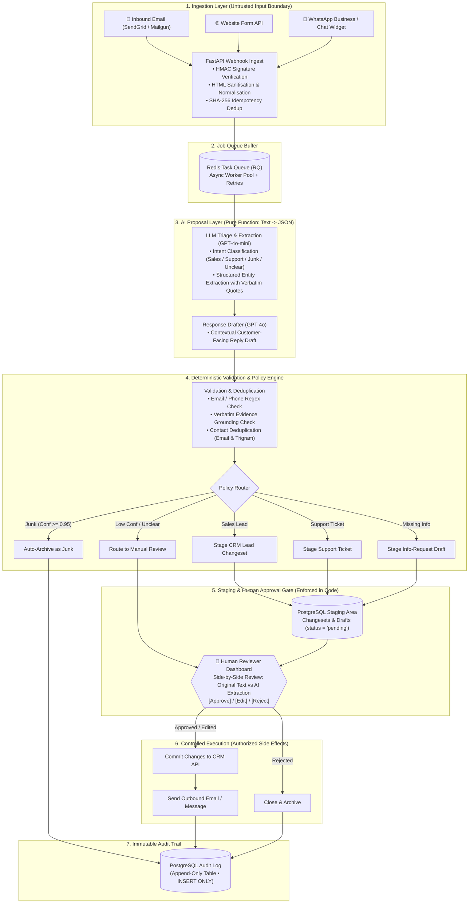
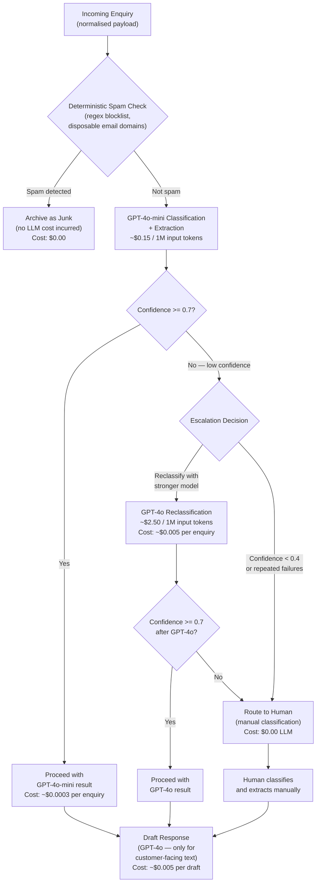
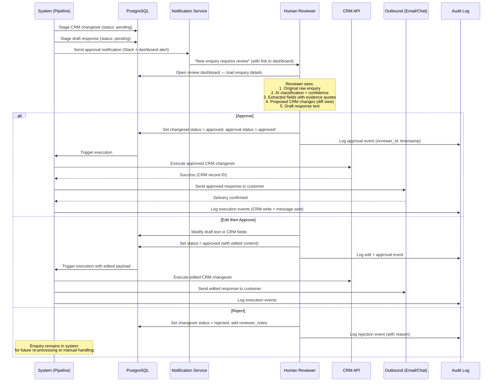
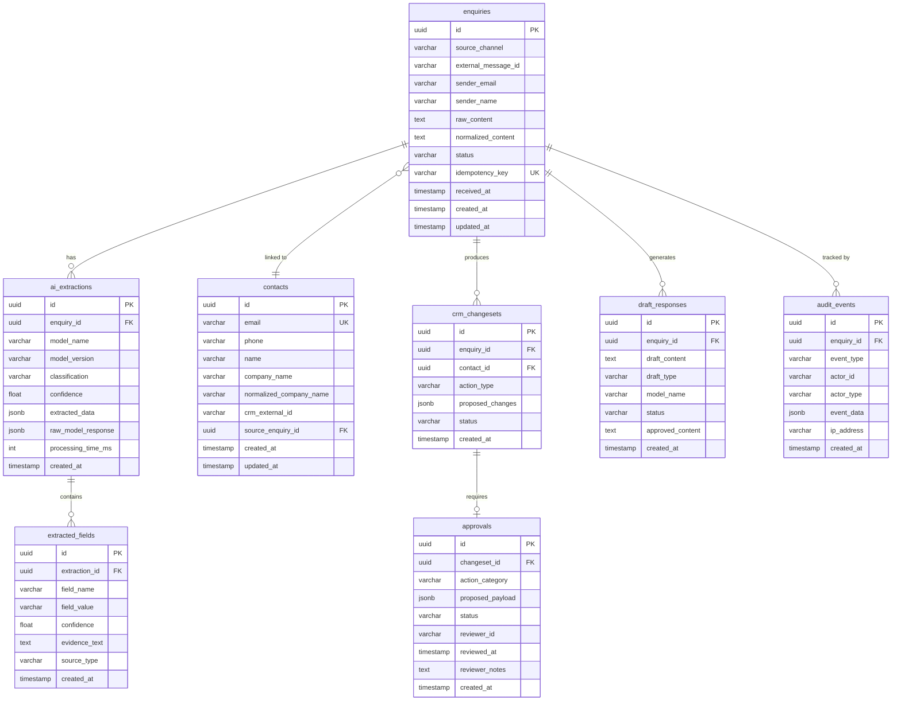

# BEDA Enquiry Processing System — Architecture Diagrams

> **Document purpose:** Visual reference for the system's architecture, data flow, failure handling, and data model.  
> Each diagram is followed by a brief explanation of its key design rationale.

---

## 1. System Architecture (Main Flow)

**Explanation:**  
The main flow is divided into five trust zones. All external input enters the **Untrusted Input Zone** and is immediately normalised by deterministic code — no AI touches raw input directly. The **AI Processing Zone** produces *proposals only*: a classification label, confidence score, and extracted fields. These are explicitly labelled as untrusted and must pass through **Deterministic Validation** (schema checks, regex, confidence thresholds) before any downstream action. The **Policy Engine** is pure rules — no ML — routing enquiries based on classification labels. The **Human Decision Zone** is the mandatory gate before any consequential action: CRM writes and outbound messages only execute after a human reviewer approves, edits, or rejects. Failure paths (dotted lines) show retry logic with exponential backoff, and a dead-letter queue ensures nothing is silently lost.

---

## 2. Data Flow Diagram

```mermaid
flowchart LR
    A["Raw Input\n(email MIME / form JSON /\nchat webhook payload)"] -->|"Adapter parses,\nstrips HTML,\nextracts headers"| B["Canonical EnquiryPayload\n(JSON with: sender, subject,\nbody_text, channel, timestamp,\nidempotency_key)"]

    B -->|"Enqueued via Redis RQ"| C["AI TriageResult\n(JSON with: classification,\nconfidence, extracted_fields[],\nevidence_texts[])"]

    C -->|"Schema + regex +\nconfidence check"| D["Validated Extraction\n(typed fields: email, phone,\ncompany, intent, budget —\neach with confidence score)"]

    D -->|"Policy engine routes,\ndedup engine matches"| E["CRM Changeset\n(JSON: action_type,\nproposed_changes,\nmatched_contact_id or null)"]

    E -->|"Queued for\nhuman review"| F{{"Human Approval\n(approve / edit / reject)"}}

    F -->|"Approved payload"| G["Executed Result\n(CRM record ID,\nsent message ID,\naudit event ID)"]
```

**Explanation:**  
This shows the data transformations for a single enquiry as it moves through the pipeline. At each step, the data format changes and gains structure: raw text becomes a canonical JSON payload, then an AI-generated triage result, then a validated extraction, then a staged CRM changeset. The human approval gate (hexagon) sits between "proposed changes" and "executed changes" — the system never auto-commits to the CRM or auto-sends messages. Each transformation is recorded in the database for full traceability.

---

## 3. Model Routing / Cost Optimisation Flow

**Explanation:**  
Cost control is built into the pipeline architecture, not bolted on. The first filter is entirely deterministic — regex and blocklist checks catch obvious spam before any LLM call, saving money on junk. The cheap model (GPT-4o-mini at ~$0.15/1M input tokens) handles the bulk of classification and extraction. Only when confidence is below 0.7 does the system consider escalating to GPT-4o (~$2.50/1M input tokens) — roughly 17x more expensive per token. If even GPT-4o is uncertain (or confidence drops below 0.4 on the initial call), the enquiry goes to a human. The expensive GPT-4o model is also used for response drafting since customer-facing text quality matters — but drafts are short, so per-enquiry cost stays low (~$0.005). For a business processing ~1,000 enquiries/month with ~30% spam, estimated monthly LLM cost is under $10.

---

## 4. Failure Recovery Flow

```mermaid
flowchart TD
    subgraph LLM_FAIL["LLM Call Failure Path"]
        LLM_CALL["LLM API Call\n(classification or extraction)"] -->|"HTTP error / timeout /\nmalformed response"| RETRY_LLM["Retry with Exponential Backoff\n(max 3 attempts:\n2s, 4s, 8s delays)"]
        RETRY_LLM -->|"succeeds"| CONTINUE_PIPELINE["Continue Normal Pipeline"]
        RETRY_LLM -->|"all retries exhausted"| MARK_FAILED["Mark enquiry status = failed\n+ log error details"]
        MARK_FAILED --> MANUAL_Q["Manual Review Queue\n(human classifies manually)"]
        MANUAL_Q --> HUMAN_CLASS["Human Classifies +\nExtracts Fields"]
        HUMAN_CLASS --> CONTINUE_PIPELINE
    end

    subgraph CRM_FAIL["CRM Write Failure Path"]
        CRM_CALL["CRM API Commit\n(after human approval)"] -->|"HTTP error / timeout /\nconflict response"| RETRY_CRM["Retry Queue\n(max 3 attempts:\n5s, 15s, 45s delays)"]
        RETRY_CRM -->|"succeeds"| LOG_SUCCESS["Log Success\n+ Update Status"]
        RETRY_CRM -->|"all retries exhausted"| DLQ["Dead-Letter Queue\n(changeset preserved\nwith full context)"]
        DLQ --> DAILY["Daily DLQ Review\n(automated report to ops team)"]
        DAILY --> MANUAL_CRM["Manual CRM Entry\n(human applies changes\ndirectly in CRM)"]
        MANUAL_CRM --> LOG_MANUAL["Log Manual Resolution\n+ Audit Event"]
    end

    subgraph EMAIL_FAIL["Email Send Failure Path"]
        EMAIL_CALL["Send Email / Message\n(after human approval)"] -->|"delivery failure"| RETRY_EMAIL["Retry with Backoff\n(max 3 attempts)"]
        RETRY_EMAIL -->|"succeeds"| LOG_SENT["Log Sent\n+ Update Draft Status"]
        RETRY_EMAIL -->|"all retries exhausted"| NOTIFY_OPS["Notify Ops Team\n(Slack alert with\nenquiry context)"]
        NOTIFY_OPS --> MANUAL_SEND["Manual Send\n(human sends from\nstandard email client)"]
        MANUAL_SEND --> LOG_MANUAL_SEND["Log Manual Send\n+ Audit Event"]
    end
```

**Explanation:**  
Every external dependency (LLM API, CRM API, email provider) is treated as unreliable. Each failure path follows the same pattern: retry with exponential backoff → exhaust retries → preserve full context → route to human. The dead-letter queue for CRM failures stores the complete approved changeset so nothing is lost — a daily automated report surfaces unresolved items. The key principle is **no silent failures**: every failure is logged as an audit event, and every unresolved failure eventually reaches a human. Enquiry status is updated at each step so the dashboard always reflects reality.

---

## 5. Human Approval Flow

**Explanation:**  
The human reviewer is the critical decision-maker for all consequential actions. The dashboard presents five pieces of context: the original enquiry, the AI's classification with confidence scores, extracted fields with evidence quotes (the exact text the AI used), a diff-style view of proposed CRM changes, and the draft response. This gives the reviewer enough information to make an informed decision without re-reading the entire enquiry. The reviewer can approve as-is, edit any field or the draft text before approving, or reject with notes. Every action — approve, edit, or reject — is recorded as an audit event with the reviewer's identity and timestamp. The system only executes CRM writes and sends messages *after* explicit human approval.

---

## 6. Entity Relationship Diagram

**Explanation:**  
The data model enforces the system's core principles at the database level. The `enquiries` table uses an `idempotency_key` (unique constraint) to prevent duplicate processing. Each enquiry can have multiple `ai_extractions` — this supports re-processing and model comparison without losing history. The `extracted_fields` table stores individual fields with per-field confidence scores and `evidence_text` (the exact quote from the source that supports each extraction), enabling the reviewer to verify AI reasoning. The `crm_changesets` table holds *proposed* changes that require an `approvals` record before execution — the schema itself enforces the human-in-the-loop pattern. The `audit_events` table has **INSERT-only permissions** (no UPDATE or DELETE) at the database role level, making the audit trail tamper-resistant. The `contacts` table uses a lowercased unique email constraint and a `normalized_company_name` field to support deduplication.

---

## Cross-References

| Topic | Document |
|---|---|
| Detailed system design and trade-offs | [System Design](../docs/system-design.md) |
| Security model and risk analysis | [Security and Risk](../docs/security-and-risk.md) |
| Failure handling and reliability | [Failure and Reliability](../docs/failure-and-reliability.md) |
| Pipeline implementation pseudocode | [Pipeline Pseudocode](../pseudocode/enquiry_pipeline.py) |
