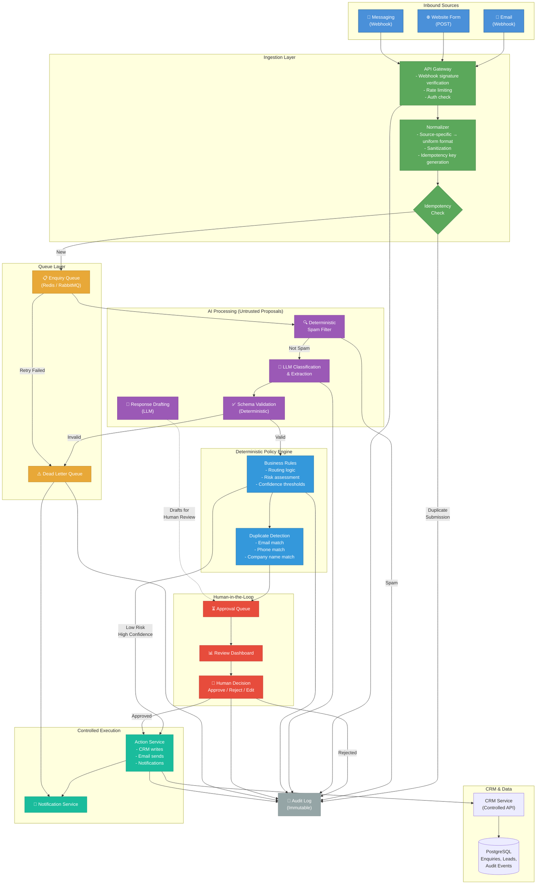
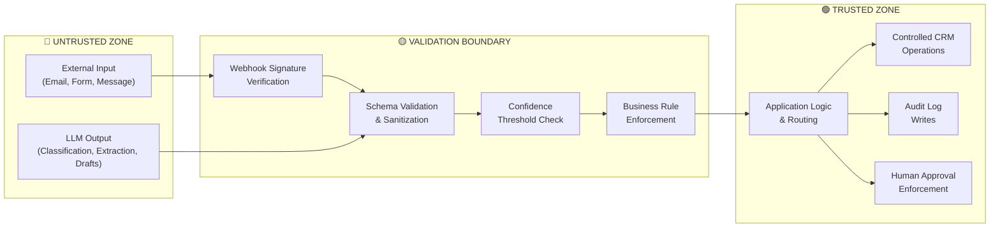
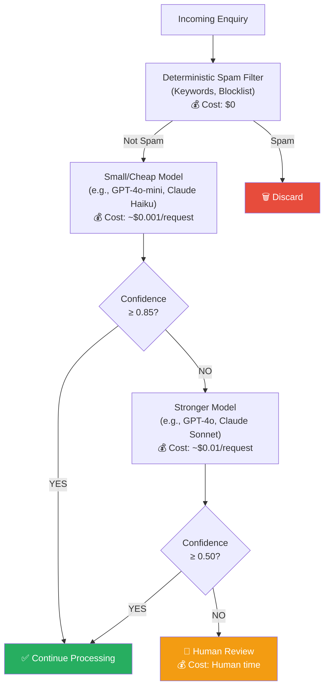
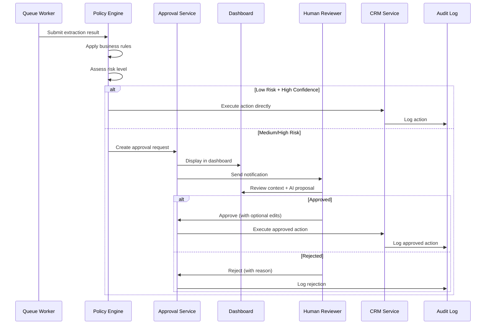

# System Architecture

## High-Level Architecture

## Trust Boundary Diagram

## Model Routing Strategy

## Approval Flow

## Component Descriptions

### Ingestion Layer
- **API Gateway**: Receives webhooks and form submissions. Verifies webhook signatures, enforces rate limits, and performs basic auth checks. No business logic here.
- **Normalizer**: Converts source-specific payloads (email headers, form fields, messaging API formats) into a uniform internal structure. Purely deterministic.
- **Idempotency Check**: Generates a SHA-256 hash from source + sender + content to prevent duplicate processing of the same submission.

### Queue Layer
- **Enquiry Queue**: Async processing buffer. Decouples ingestion from processing, enabling retries and backpressure handling.
- **Dead Letter Queue (DLQ)**: Catches permanently failed enquiries after max retries. Triggers alerts. Human operators can inspect and reprocess.

### AI Processing
- **Deterministic Spam Filter**: Rule-based keyword and blocklist check. Runs before the LLM to avoid unnecessary API costs.
- **LLM Classification & Extraction**: Sends sanitized enquiry content to an LLM with a strict output schema. Response is treated as an **untrusted proposal**.
- **Schema Validation**: Deterministic check that LLM output conforms to expected types, value ranges, and evidence requirements.
- **Response Drafting**: LLM generates a draft response. Drafts are **never sent automatically** — they go to the approval queue.

### Policy Engine
- **Business Rules**: Deterministic routing based on intent, confidence, and risk. Maps classifications to concrete actions (create lead, route to support, request clarification, discard).
- **Duplicate Detection**: Exact and fuzzy matching on email, phone, and company name against existing CRM records. No LLM involvement in merge decisions.

### Human-in-the-Loop
- **Approval Queue**: Stores pending actions with full context for human review.
- **Review Dashboard**: Presents the AI's proposal alongside the original enquiry, extracted data, confidence scores, and evidence. Humans can approve, reject, or edit.
- **Human Decision**: Approval is enforced by the application. The LLM cannot bypass this gate.

### Controlled Execution
- **Action Service**: Executes approved actions (CRM writes, email sends) through scoped service accounts. Never exposes raw credentials to the AI layer.
- **Notification Service**: Sends internal alerts (Slack, email) for approvals, failures, and escalations.

### Audit Log
- Immutable append-only log of every significant event: ingestion, classification, routing decisions, approvals, CRM writes, failures.
