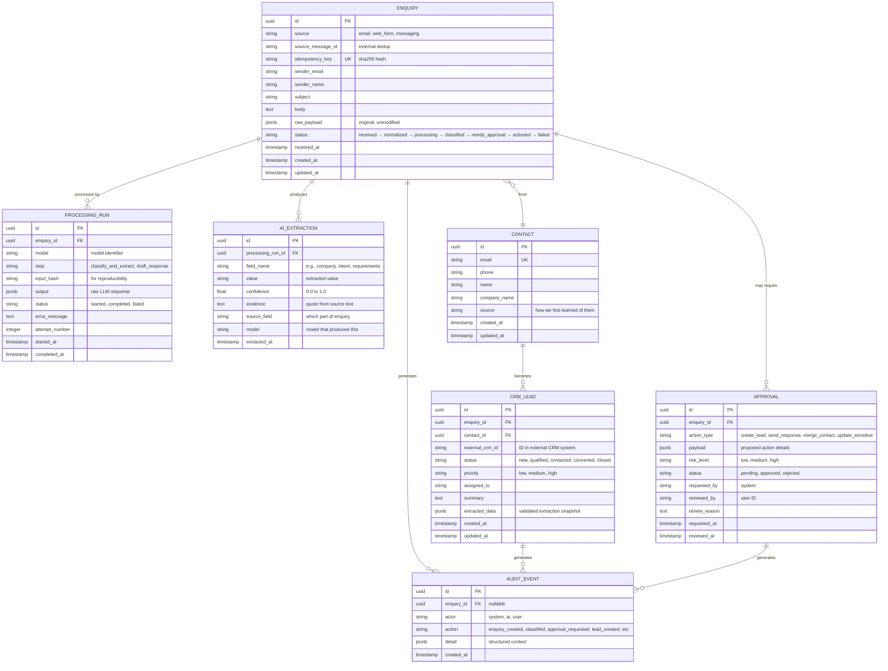

# System Design

## 1. Data Model

### Entity Relationship



### Why Provenance Matters

The `AI_EXTRACTION` table stores not just the extracted value but also confidence, evidence, source field, and model version. This is critical because:

1. **Auditability**: When a CRM lead shows a company name, we can trace exactly where that data came from — was it typed by the customer, extracted by the AI, or entered by a human?
2. **Trust calibration**: Low-confidence extractions are flagged for review. Without confidence scores, everything looks equally reliable.
3. **Evidence grounding**: The `evidence` field stores the exact quote from the source text that supports the extraction. If the AI claims the company is "Acme Corp" but the evidence is an unrelated sentence, the validation layer catches the hallucination.
4. **Reproducibility**: The `input_hash` and `model` fields allow re-running the same extraction to check for consistency.
5. **Debugging**: When an extraction is wrong, the processing run history shows exactly what the model received and returned, enabling root cause analysis.

**Without provenance, AI-extracted data silently becomes "ground truth" in the CRM, and nobody can tell whether it came from the customer or from a hallucination.**

## 2. LLM vs. Deterministic Code vs. Human

| # | Responsibility | LLM/Agent | Deterministic Code | Human | Reasoning |
|---|---------------|-----------|-------------------|-------|-----------|
| 1 | **Intent classification** | ✅ Proposes | Validates confidence | Reviews low-confidence | Natural language understanding is the LLM's strength. But the classification is a *proposal* that passes through confidence thresholds. |
| 2 | **Information extraction** | ✅ Extracts | Validates schema + evidence | Reviews extractions without evidence | Extracting names, companies, requirements from free text is an LLM task. But every extraction must have a source reference. |
| 3 | **Entity extraction** | ✅ Identifies | Validates format (email, phone) | Reviews ambiguous entities | LLM identifies potential entities; deterministic code validates formats. |
| 4 | **Summarization** | ✅ Generates | Checks length/format | N/A (internal use) | Summaries are for internal use only, low risk. |
| 5 | **Draft response generation** | ✅ Drafts | Checks against templates | **Approves before sending** | AI drafts are never sent automatically. Every outbound message requires human approval. |
| 6 | **Semantic matching** | ✅ Suggests | N/A | Reviews suggestions | Useful for matching enquiries to products/services, but suggestions only. |
| 7 | **Suggesting missing info** | ✅ Identifies gaps | Checks against required fields | Reviews before acting | AI can identify what's missing; deterministic code checks required field lists. |
| 8 | **Authentication** | ❌ | ✅ Enforces | N/A | Webhook signatures, API keys — purely deterministic. Never delegated to AI. |
| 9 | **Authorization** | ❌ | ✅ Enforces | Configures policies | Permission checks are boolean logic, not language understanding. |
| 10 | **Input validation** | ❌ | ✅ Validates | N/A | Email format, required fields, data types — deterministic rules. |
| 11 | **Business rules & routing** | ❌ | ✅ Applies rules | Defines rules | "Sales enquiries go to sales team" is a rule, not a language task. |
| 12 | **Duplicate detection** | ❌ | ✅ Exact/fuzzy match | Confirms ambiguous matches | Email/phone matching is deterministic. Company name fuzzy matching uses normalized strings, not LLM. |
| 13 | **CRM record creation** | ❌ | ✅ Creates records | Approves sensitive creates | Database writes are never delegated to the LLM. |
| 14 | **Database writes** | ❌ | ✅ Executes | N/A | All persistence is through validated service calls. |
| 15 | **Rate limiting** | ❌ | ✅ Enforces | N/A | Counting and throttling — pure math. |
| 16 | **Retry logic** | ❌ | ✅ Manages | N/A | Exponential backoff is algorithmic, not a language task. |
| 17 | **Idempotency** | ❌ | ✅ Checks | N/A | Hash-based deduplication — deterministic. |
| 18 | **Secret handling** | ❌ | ✅ Manages | N/A | Secrets never enter the LLM context. |
| 19 | **Audit logging** | ❌ | ✅ Records | Reviews logs | Immutable, append-only logging — deterministic. |
| 20 | **Sending external messages** | ❌ | ❌ (after approval) | **Must approve** | Outbound communication can create commitments. Always requires human sign-off. |
| 21 | **Financial decisions** | ❌ | ❌ | **Must decide** | Pricing, quotations, contracts — human judgment required. |
| 22 | **Record deletion/merge** | ❌ | ❌ | **Must approve** | Irreversible actions on customer data require human confirmation. |

### Summary of the Division

- **LLM**: Understanding language, extracting meaning, generating drafts. It is a *consultant* that proposes.
- **Deterministic code**: Enforcing rules, validating data, managing state, controlling access. It is the *gatekeeper*.
- **Human**: Making judgment calls on high-stakes decisions. They are the *authority*.

## 3. Technology Choices

| Component | Technology | Why | Alternative Considered |
|-----------|-----------|-----|----------------------|
| **Backend** | Python + FastAPI | Async-native, excellent for I/O-bound work (LLM calls, webhooks). Strong ecosystem for AI/ML. Well-suited for structured API design. | Django (heavier, less async-native), Node.js (viable but Python has better LLM library support) |
| **Queue** | Redis (with Redis Streams or Bull) | Simple to operate, supports delayed jobs, good enough for the expected volume. Single dependency for both caching and queueing. | RabbitMQ (more robust for high volume, but adds operational complexity). For production scale, RabbitMQ or a managed queue (AWS SQS) would be a reasonable upgrade. |
| **Database** | PostgreSQL | Battle-tested, JSONB support for flexible extraction storage, strong consistency, excellent tooling. | MySQL (viable), MongoDB (JSONB in Postgres gives us schema flexibility without sacrificing relational integrity) |
| **LLM (fast/cheap)** | GPT-4o-mini or Claude Haiku | Low cost (~$0.001/request), fast response, sufficient for clear-cut classification and extraction. | Open-source models via Ollama (viable for development and privacy-sensitive workloads, but adds hosting/scaling burden) |
| **LLM (strong)** | GPT-4o or Claude Sonnet | Higher accuracy for ambiguous cases. Used only when the cheap model has low confidence — cost-effective escalation. | Claude Opus (more capable but significantly more expensive — overkill for most cases) |
| **CRM** | Generic REST API client | BEDA's actual CRM is unspecified. Designing against a generic interface means the system can integrate with HubSpot, Salesforce, Pipedrive, or a custom CRM by implementing the adapter. | Direct CRM SDK (locks us into one platform) |
| **Email** | SendGrid or Mailgun API | Reliable delivery, webhook support for inbound email, good deliverability tracking. | SMTP directly (less reliable, harder to monitor) |
| **Messaging** | Webhook-based integration | Slack, WhatsApp, and similar platforms all support inbound webhooks. A generic webhook handler with source-specific normalizers keeps the system extensible. | Platform-specific SDKs (adds complexity per channel) |
| **Secrets** | Environment variables (dev) / Cloud secret manager (prod) | Simple, secure, and standard. No custom secret management needed at this scale. | HashiCorp Vault (overkill for this scale) |
| **Observability** | Structured logging (Python `structlog`) + Prometheus metrics | Structured JSON logs are searchable and parseable. Prometheus metrics give visibility into queue depth, latency, error rates. | Full OpenTelemetry tracing (valuable for production, but structured logging is the practical starting point) |

### What I Deliberately Did Not Include

- **Kubernetes**: Not needed at this scale. A single server or simple container deployment (Docker Compose) is sufficient to start.
- **Microservices**: The system is a monolith with clean internal boundaries (services, not separate deployments). Microservices add network complexity, deployment overhead, and debugging difficulty without clear benefit at this scale.
- **Vector database**: Not needed. The system classifies and extracts from individual enquiries, not from a large corpus requiring semantic search.
- **LangChain/agent framework**: The pipeline is simple enough that a direct LLM API call with structured output is cleaner than an agent framework. Agent frameworks add abstraction layers that make debugging and auditing harder.

## 4. Incomplete Information Handling

### The Problem

Many enquiries lack the information needed to act on them:

> "We are interested in your service. How much does it cost?"

This enquiry has a clear **intent** (sales) but is missing critical information:
- What specific service are they interested in?
- What is their company size?
- What is their budget range?
- What is their timeline?

### Three Categories of Information

| Category | Definition | Example | CRM Treatment |
|----------|-----------|---------|---------------|
| **Present information** | Explicitly stated in the enquiry | "My name is Sarah from TechCorp" | Extracted and stored with high confidence |
| **Missing information** | Known to be needed but not provided | Company size, budget, timeline | Flagged as missing. System may draft a clarification question (with human approval). **Never invented.** |
| **Inferred information** | Guessed from context but not stated | "TechCorp" sounds like a tech company → probably interested in tech services | Stored with low confidence and clearly marked as `source: "inferred"`. **Never treated as fact.** |

### Design Rules

1. **Missing ≠ Unknown**: If the enquiry doesn't mention a budget, the budget field is `null`, not `"unknown"` or a guess.
2. **Inferred data is labeled**: If the LLM infers the company industry from the name, it's stored with `confidence: 0.4` and `source: "inferred_from_name"`.
3. **No silent invention**: The system NEVER fills in fields with plausible-sounding data that isn't grounded in the source text.
4. **Clarification over assumption**: For sales enquiries with missing critical information, the system drafts a clarification request (subject to human approval) rather than proceeding with incomplete data.

### Structured Output for Missing Information

```json
{
  "missing_information": [
    {
      "field": "company_size",
      "reason": "Not mentioned in enquiry. Needed for pricing tier.",
      "suggested_question": "Could you share how many team members would be using the service?"
    },
    {
      "field": "specific_service",
      "reason": "Enquiry mentions 'your service' generically.",
      "suggested_question": "Which of our services are you most interested in?"
    }
  ]
}
```

The `suggested_question` is an AI draft. It goes through the approval queue before being sent.

## 5. Duplicate Record Handling

### Detection Signals

| Signal | Match Type | Confidence | Example |
|--------|-----------|------------|---------|
| Email address (exact) | Exact match | 1.0 | `sarah@techcorp.com` matches existing contact |
| Phone number (normalized) | Exact match | 0.95 | `+62-812-3456-7890` normalized and matched |
| External message ID | Exact match | 1.0 | Same email `Message-ID` header |
| Existing CRM ID | Exact match | 1.0 | Enquiry references a known CRM ID |
| Company name (normalized) | Fuzzy match | 0.70 | "TechCorp" vs "Tech Corp International" |

### Resolution Strategy

```
Match confidence >= 0.95 → EXACT MATCH
  → Update existing record (non-sensitive fields only)
  → Log as "existing_contact_updated"

Match confidence 0.70–0.94 → PROBABLE MATCH
  → Flag for human confirmation
  → Present both records side-by-side
  → Human decides: link, merge, or create new

Match confidence < 0.70 → POSSIBLE DUPLICATE
  → Flag for human review
  → Default to creating new record if not reviewed within SLA

No matches → NEW RECORD
  → Create new contact and lead
```

### What the LLM Does NOT Do

- The LLM does **not** decide whether to merge records
- The LLM does **not** overwrite existing CRM data
- The LLM does **not** have access to search the CRM directly

Duplicate detection is a deterministic process using database queries with exact and normalized matching.

## 6. Hallucination Prevention

### Controls

| Control | Implementation | Example |
|---------|---------------|---------|
| **Structured output schema** | LLM must return JSON conforming to a predefined schema. Non-conforming output is rejected. | If `intent` is not one of `["sales", "support", "spam", "incomplete", "unknown"]`, validation fails. |
| **Confidence thresholds** | Every extraction includes a confidence score. Below 0.85: flag for review. Below 0.50: escalate to stronger model or human. | Company name extracted with 0.45 confidence → human reviews before CRM write. |
| **Evidence requirement** | Extracted fields must include an `evidence` quote from the source text. Extractions without evidence are rejected. | `"company": {"value": "TechCorp", "evidence": "My name is Sarah from TechCorp"}` |
| **Source grounding** | LLM is instructed to extract only from provided text. Claims not found in the source are flagged. | If the email says nothing about budget, the system rejects any budget value the LLM provides. |
| **Trusted source retrieval** | If the system looks up company information, it uses only whitelisted sources (company website, LinkedIn API). | No open web scraping. No arbitrary URL fetching. |
| **No unsupported claims** | Draft responses are checked against extracted data. The AI cannot include claims not supported by source material. | Draft says "as discussed in our previous meeting" — rejected because no previous meeting is referenced in the data. |
| **Validation before CRM write** | Every field written to CRM passes through format validation and field whitelist checks. | Email must match regex. Phone must be valid format. Unknown fields are dropped. |
| **Human review for edge cases** | Low confidence + high impact → mandatory human review. | Sales enquiry with 0.55 confidence → human classifies before lead creation. |
| **Prompt injection defense** | User content is isolated in the prompt. System instructions explicitly warn against following instructions in user content. | See security document for detailed prompt injection controls. |
| **Tool allowlist** | The LLM has NO tool access. It returns structured data only. All actions are performed by application code. | LLM cannot call APIs, execute code, or access databases. |

### Practical Example

**Enquiry email**:
> "Hi, I'm Alex from GreenTech Solutions. We're a mid-size renewable energy company looking for AI consulting services for our customer support team. Can you send us pricing for a team of about 50?"

**LLM extraction (untrusted proposal)**:
```json
{
  "intent": "sales",
  "confidence": 0.94,
  "contact": {
    "name": "Alex",
    "email": null
  },
  "company": {
    "value": "GreenTech Solutions",
    "confidence": 0.96,
    "evidence": "I'm Alex from GreenTech Solutions"
  },
  "requirements": [
    {
      "value": "AI consulting for customer support",
      "confidence": 0.92,
      "evidence": "looking for AI consulting services for our customer support team"
    }
  ],
  "missing_information": [
    {"field": "email", "reason": "No email address provided in the message body"},
    {"field": "timeline", "reason": "No timeline mentioned"},
    {"field": "budget", "reason": "No budget range mentioned"}
  ],
  "summary": "Sales enquiry from GreenTech Solutions seeking AI consulting for customer support, team size ~50.",
  "priority": "high",
  "recommended_action": "human_review"
}
```

**Validation checks (deterministic)**:
1. ✅ `intent` is a valid enum value
2. ✅ `confidence` is between 0.0 and 1.0
3. ✅ `company.evidence` contains "GreenTech Solutions" — grounded in source
4. ✅ `requirements[0].evidence` matches source text
5. ✅ `email` is null (not invented)
6. ✅ `budget` is not present (not hallucinated)

**Result**: Extraction passes validation. Business rules route it to human review (high priority sales enquiry).
